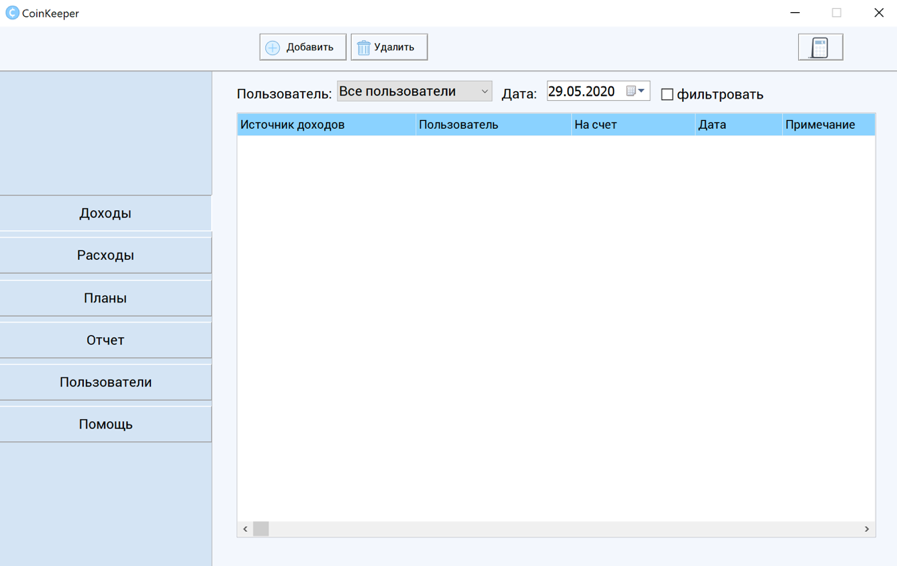
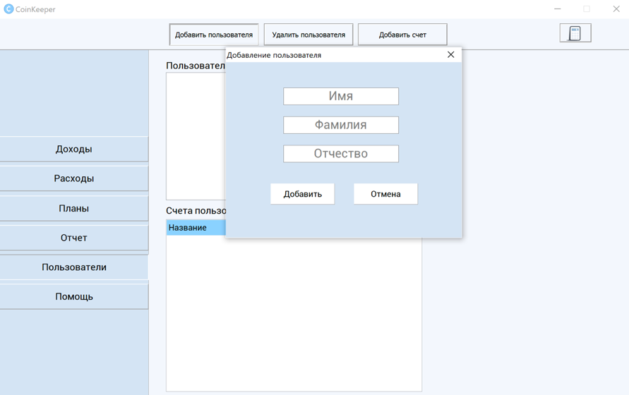
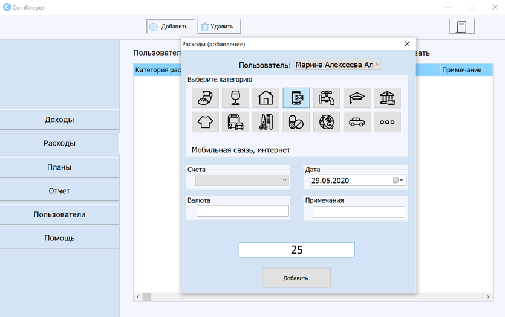
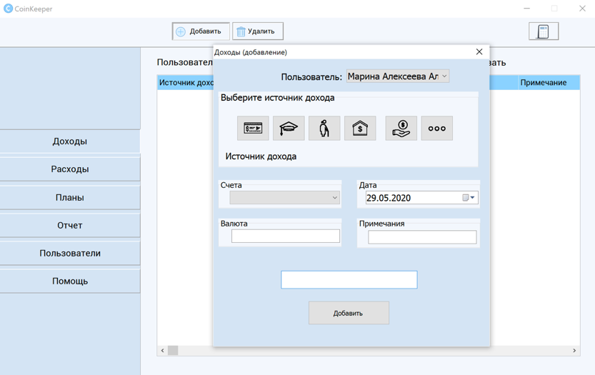
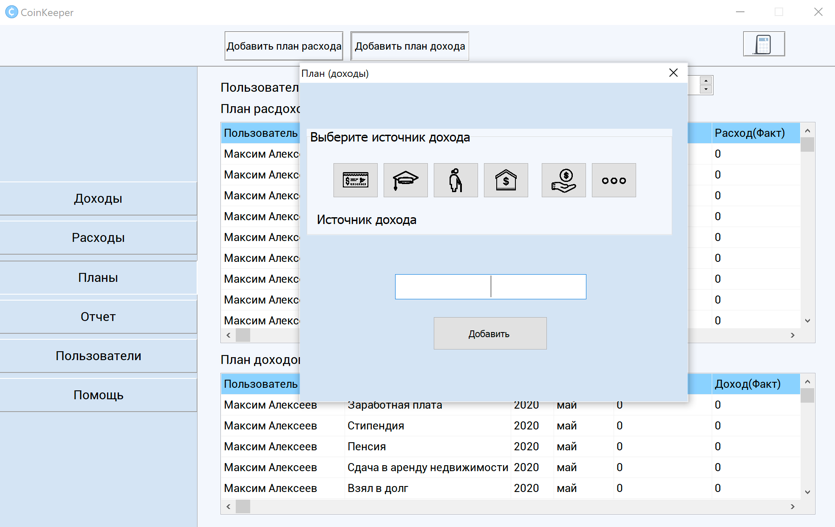
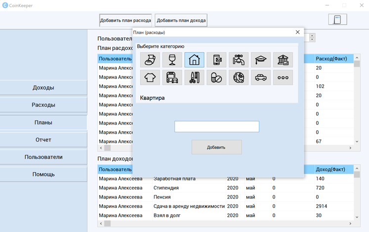
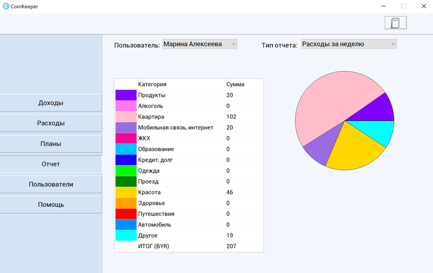

# Family-accounting-software
>[download file](https://github.com/protasenya02/Family-accounting-software/blob/master/final/CoinKeeper.exe)

>[source code](https://github.com/protasenya02/Family-accounting-software/blob/master/final/units/UnitMain.pas)

>[note](https://github.com/protasenya02/Family-accounting-software/blob/master/final/Пояснительная%20записка%20Протасеня.docx)

>[program diagram](https://github.com/protasenya02/Family-accounting-software/blob/master/final/схема%20программы.png)

# Visual appearance 

>Main menu

The main communication with the program is performed through the user-friendly menu which consists of 6 sections: Income, Expenditure, Plans, Report, Users, Help.

>​

>Add User

To add a user, you should click on the "Users" button in the side menu. This section contains the list of users and their bills. An unlimited number of users that can have up to 10 bills in different currencies (Belarusian ruble, Russian ruble, Dollar) can use the program. You can choose the name of the account from the offered ones or enter it by yourself. 

>​

>Adding income and expenses

The list of profits is completed in the "Income" section, which also contains the table of earnings of all users.

>​

The user's expenses are entered in the "Expenses" section after clicking on the "Add" button. 

>​

>Budget planning 

Budget planning is done in the section "Plans". To add plans of expenses or income for the month, click on the corresponding button and enter the amount in Belarusian rubles. Also, for better budget tracking, the table of plans of expenses (income) shows the difference between actual and planned expenses (income).

>​

>

>Budget report

To get a budget report, go to the "Report" section, select a user and a report type. The amounts of expenses or profit for the selected period are placed in the table by categories. The percentage ratio of expenses (income) to total expenses (income) is shown in the pie chart.

>
